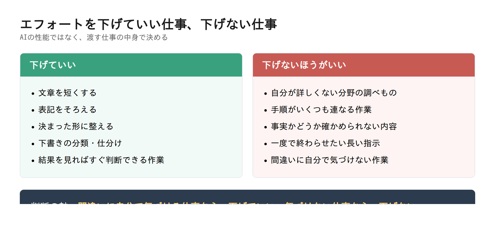

# （タイトルは3_タイトルで決定）

## 目次

- [エフォートは「どれだけ考えさせるか」のつまみです](#エフォートはどれだけ考えさせるかのつまみです)
- [5段階で何が変わるのか](#5段階で何が変わるのか)
- [私が「即答タイプ」にして失敗した話](#私が即答タイプにして失敗した話)
- [下げていい場面、下げないほうがいい場面](#下げていい場面下げないほうがいい場面)
- [どこで設定するのか](#どこで設定するのか)
- [やりがちな3つのかんちがい](#やりがちな3つのかんちがい)
- [まとめ](#まとめ)

---

## エフォートは「どれだけ考えさせるか」のつまみです

**この章でわかること：エフォートが何を決めている設定なのか。**

AIを使っていて、こう感じたことはありませんか。

「返事は速いけれど、中身が浅い」
「やたら待たされるけれど、そこまで丁寧じゃなくていいのに」

この2つは、多くの場合、AIの性能の問題ではありません。**「どれだけ手間をかけて答えるか」の設定**で決まっています。

Claudeには、エフォート（effort）という設定があります。簡単に言うと、**AIにどれだけ考えさせるかを選ぶ、つまみ**です。つまみを右に回せばじっくり考え、左に回せばさっと答えます。

エフォートが効くのは、考える部分だけではありません。Anthropicの公式ドキュメントによると、返事の文章、AIが道具を使うときの動き、そして考える量、その**すべて**にエフォートが効きます（出典：[Effort - Claude Platform Docs](https://platform.claude.com/docs/en/build-with-claude/effort)）。

もうひとつ、大事な性質があります。エフォートは**きっちりした上限ではなく、「だいたいこのくらいでいこう」という目安**です。低く設定しても、難しい問題ならAIは考えます。ただし、高く設定したときよりは考える量が少なくなります。公式ドキュメントでは「behavioral signal（振る舞いの目安）」と説明されています。

---

## 5段階で何が変わるのか

**この章でわかること：5つのレベルの違いと、それぞれが向いている場面。**

エフォートは5段階あります。低いほうから順に、low（ロー）、medium（ミディアム）、high（ハイ）、xhigh（エックスハイ）、max（マックス）です。

*図1：エフォートの5段階（Anthropic公式ドキュメントの説明をもとに作成）*

この表で押さえてほしいのは、**highが標準だ**という一点です。

公式ドキュメントによると、エフォートを何も指定しないときの動きは、highを指定したときと**完全に同じ**です。つまり、設定をいじっていない人は、すでにhighを使っています。

そして、highより下のmediumとlowは、速さと費用のために少しだけ性能を譲る設定です。highより上のxhighとmaxは、時間と費用を多く使って、より深く考えさせる設定です。

なお、使えるレベルはモデルによって違います。maxには対応しているけれど、xhighには対応していないモデルもあります。

---

## 私が「即答タイプ」にして失敗した話

**この章でわかること：エフォートを下げすぎると、具体的に何が起きるのか。**

私自身の失敗を書きます。

作業を速く進めたくて、AIを**あまり考えずに即答するタイプ**に設定して使ったことがあります。結果は、期待とはまったく違うものでした。

起きたことは2つです。

**1つめ。まったく的はずれな回答を、さも事実であるかのように返してきました。**
言い切りの調子だったので、うっかり信じそうになりました。読み返して初めて、内容が噛み合っていないことに気づきました。

**2つめ。こちらが指示したことを、最後までやりきりませんでした。**
複数のお願いをひとつの指示にまとめて渡したのですが、途中までで手が止まっていました。本人（AI）は終わったつもりで、簡潔な完了報告を返してきます。

あとから公式ドキュメントを読んで、腑に落ちました。エフォートを下げると、AIは次のような動きになると書かれています。

- 複数の作業をまとめて、少ない手数で済ませようとする
- 道具を使う回数が減る
- 前置きなしで、すぐ作業に入る
- 終わったあとの報告が簡潔になる

私が見たものは、まさにこの動きでした。**手を抜いていたのではなく、設定どおりに動いていた**わけです。指示が長いほど、この「手数を減らす」性質は、やり残しとして表に出てきます。

---

## 下げていい場面、下げないほうがいい場面

**この章でわかること：エフォートを下げる判断の基準。**

前の章の失敗から言えるのは、「低いエフォートが悪い」ではありません。**渡す仕事の中身と、設定が合っていなかった**ということです。

*図2：仕事の中身で判断する（公式ドキュメントの推奨をもとに作成）*

判断の軸は、次の一言に集約できます。

**間違いに自分で気づける仕事なら、下げていい。気づけない仕事なら、下げない。**

言葉を短くする、表記をそろえる、といった作業は、結果を見ればすぐ判断できます。ここは下げて問題ありません。

一方、自分がよく知らない分野の調べもの、いくつもの手順が連なる作業、事実かどうかを自分で確かめられない内容。ここを下げると、私が経験したことが起きます。**間違いに気づけないまま、それらしい文章を受け取ってしまいます。**

---

## どこで設定するのか

**この章でわかること：エフォートを実際に切り替える方法。**

エフォートは、Claude Code（パソコンで使う開発向けの道具）と、Claude API（プログラムから使う仕組み）で設定できます。

Claude Codeの場合、いちばん簡単なのは次の方法です。

1. Claude Codeを起動する
2. `/effort` と入力する
3. 出てきた一覧から、使いたいレベルを選ぶ

`/model` でモデルを選ぶ画面からも、エフォートを変えられます（出典：[Model configuration - Claude Code Docs](https://code.claude.com/docs/en/model-config)）。

そして、**選んだレベルは画面に表示されます。** モデル名の隣に「with high effort」のように出るので、今どの設定で動いているかは、いつでも確認できます。

まず試すなら、こうしてください。

- **普段はそのまま**（何も設定しなければhighです）
- **簡単で急ぎの作業のときだけ**、`/effort medium` か `/effort low` に下げる
- **作業が終わったら戻す**

いきなり全部を下げる必要はありません。

---

## やりがちな3つのかんちがい

**この章でわかること：エフォートで失敗しやすい3つのポイント。**

**かんちがい1：高くすればするほど良い**

公式ドキュメントは、maxについて「多くの作業では、費用が大きく増えるわりに品質の向上は比較的小さい」「一部の作業では考えすぎ（overthinking）につながることがある」と書いています。上げれば上げるほど良くなる、という設定ではありません。

**かんちがい2：会話の途中で気軽に変える**

エフォートを会話の途中で変えると、それまでの会話を再利用するしくみ（プロンプトキャッシュ）が効かなくなります。簡単に言うと、AIが会話の最初から読み直すことになり、そのぶん費用がかかります。長い会話をする日は、**最初にレベルを決めて、その日は変えない**ほうが無難です。

**かんちがい3：費用に関係ないと思っている**

AIが考えた分の文字（思考トークン）は、**返事の文字と同じ扱いで課金されます**（出典：[Manage costs effectively - Claude Code Docs](https://code.claude.com/docs/en/costs)）。深く考えさせるほど、請求は増えます。逆に言えば、エフォートは**モデルを変えずに費用を下げられる、数少ない手段**でもあります。

---

## まとめ

エフォートは、AIにどれだけ手間をかけさせるかを選ぶつまみです。

- 何も設定していなければ、すでにhigh（標準）で動いています
- 下げると、速く安くなります。そのかわり、手数を減らし、指示の範囲を狭く解釈します
- 間違いに自分で気づける仕事なら下げていい。気づけない仕事では下げない
- 高くすればするほど良い、という設定ではありません

私は「即答タイプ」に下げたまま、調べものを任せて痛い目を見ました。あなたが同じ失敗をしないために、まずは一度 `/effort` と打って、**今の自分の設定を見るところから**始めてみてください。

---

### 参考にした資料

- [Effort - Claude Platform Docs](https://platform.claude.com/docs/en/build-with-claude/effort)
- [Model configuration - Claude Code Docs](https://code.claude.com/docs/en/model-config)
- [Manage costs effectively - Claude Code Docs](https://code.claude.com/docs/en/costs)
